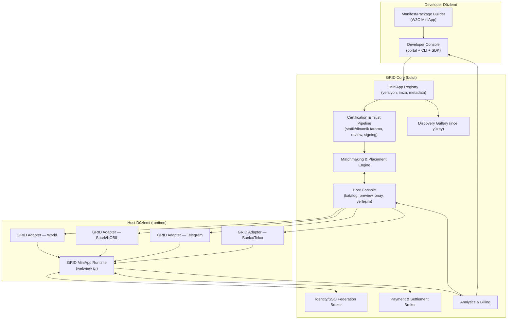
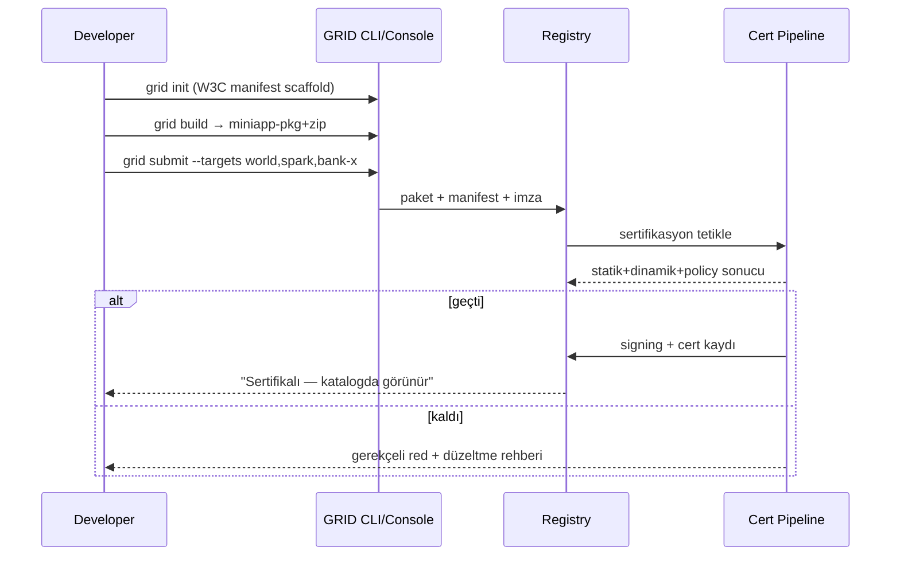
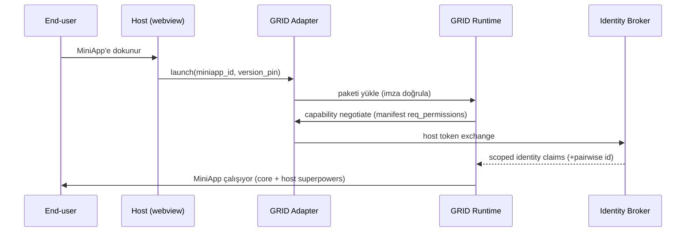
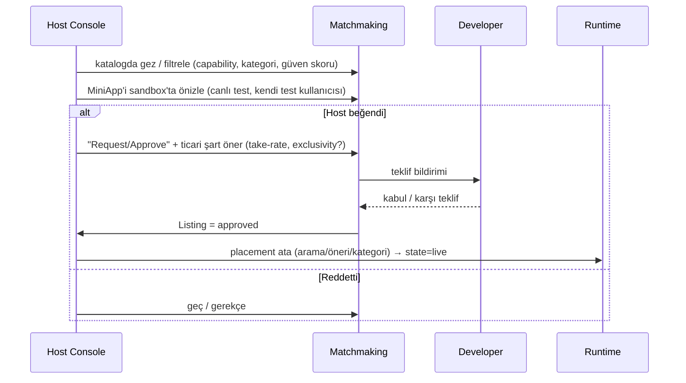

# GRID — Proje & Mimari Dokümanı

> **Çalışma kod adı:** GRID (super app'lerin altındaki dağıtım şebekesi)
> **Tek cümle:** Geliştirici bir kez MiniApp yazar, GRID onu **hazır kullanıcısı olan** birçok super app / host'un içine — tek entegrasyon, tek panel, tek sözleşme ile — güvenli biçimde dağıtır. App **for** apps, **for** users. Direkt user'a değil.
> **Standart temel:** W3C MiniApp (Manifest + Packaging + Lifecycle) — kendi format icat edilmez, standart benimsenir.
> **Versiyon:** v0.1 (mimari taslak) · **Statü:** iç tartışma / yatırımcı-öncesi

---

## 0. Yönetici Özeti (TL;DR)

Bugün bir dijital ürünün en büyük katili **kullanıcı edinme maliyeti (CAC)** ve **dağıtım parçalanması**: herkes ya kendi App Store / Play Store uygulamasını yapıp sıfırdan kullanıcı avlıyor, ya da her super app için ayrı ayrı, birbirinden habersiz mini-app yazıyor.

GRID bunu tersine çeviriyor. Model **App2App2User**: geliştirici GRID standardına göre **bir kez** yazar; GRID onu World, Spark, İstanbul Senin, banka super app'leri, telco super app'leri gibi **kullanıcısı zaten orada olan** host'ların içine yerleştirir. Kullanıcı bulma yükü geliştiriciden host'a kayar — çünkü kullanıcıyı host getirir.

GRID **marketplace değil, dağıtım rayı.** Görünen ucu bir katalog/galeri; asıl ürün altındaki üç şey:
1. **Runtime + Host Adapter SDK** — tek paketi her host'un içinde çalıştıran soyutlama katmanı.
2. **Kimlik/SSO federasyonu + ödeme köprüsü** — host'ların auth ve para raylarını normalize eden broker.
3. **Güven / sertifikasyon / güvenlik hattı** — host'a "bu kataloğu içime alabilirim" güvenini veren, kopyalanması en zor katman (= hendek).

Savunulabilir çekirdek **host federasyonu**: GRID engine'ini çalıştıran host'lar tanım gereği tek runtime paylaşır → "tek entegrasyon, hepsinde" o federasyonun *içinde* %100 gerçek olur. WeChat/Alipay gibi kapalı devler brokerlik edilemez; onlar "reach" için compile-target/kenar adaptörü olur, çekirdek vaat değil.

Beachhead: **KOBIL / Spark / İstanbul Senin** ile Tier-1 host'ları seed'le, W3C uyumunu day-one koy, sonra Tier-2 açık ekosistemlere (World, Telegram) genişle.

---

## 1. Problem & Tez

### 1.1 Kimin, hangi acısı

**Geliştirici / ürün ekibi acısı**
- Yeni bir uygulama = sıfırdan kullanıcı edinme. CAC yüksek, ROI belirsiz, App/Play Store keşfi tıkanmış.
- Super app'lerin içine girmek çekici (hazır kullanıcı) ama her biri ayrı SDK, ayrı auth, ayrı ödeme, ayrı review, ayrı sözleşme. N host = N kez sıfırdan entegrasyon cehennemi.
- Sonuç: geliştirici ya tek bir host'a kilitlenir ya da hiç girmez.

**Host / ekosistem acısı (super app veya super-app olmak isteyen banka/telco/civic app)**
- Kullanıcı elde tutmanın yolu hizmet derinliği; ama kaliteli mini-app tedariki zor.
- Kendi mini-app platformunu (runtime, review, güvenlik, developer portalı, ödeme) sıfırdan kurmak ağır mühendislik + sürekli operasyon.
- Düşük kaliteli/güvensiz mini-app host markasına zarar verir (Apple'ın kapıcılık sebebi).

**Kullanıcı acısı (dolaylı)**
- Her hizmet için ayrı uygulama indirmek, ayrı hesap açmak. Home screen çöplüğü, install sürtünmesi.

### 1.2 Tez: App2App2User

> Uygulamalar doğrudan kullanıcıya değil, **kullanıcının zaten bulunduğu uygulamaların içine** dağıtılır.

- Geliştirici için: **user bulma derdi yok** — o dert host'a devredildi.
- Host için: **hizmet kataloğu, tesisat kurmadan derinleşir** — stickiness artar.
- GRID için: ikisinin arasındaki **ön-pazarlıklı dağıtım + tek kontrol paneli** — satılan şey standart değil, standardın üstündeki dağıtım ağının anahtarı.

### 1.3 "User bulma derdi yok" — dikkat: dert yok olmuyor, yer değiştiriyor

Bu tezin dürüst versiyonu için üç gerçeği baştan tasarıma gömüyoruz:
1. **Host'a girmek ≠ host içinde bulunmak.** Hazır kullanıcı bir *havuz*, otomatik huni değil. Keşif/placement/attention hâlâ kazanılmalı — ama artık GRID'in placement motoru + host'un giriş noktaları üzerinden. (Bölüm 5.7)
2. **Host'lar eşit değil.** Kimini kontrol edersin (vaadi anında teslim), kiminde tedarikçilerden birisin, kimini hiç brokerlik edemezsin. (Bölüm 4.3)
3. **Kalite > hacim.** Host'a değer "app yığını" değil, **küratörlü + denetlenmiş + standart-uyumlu tedarik hattı.** (Bölüm 5.6)

---

## 2. GRID Ne? (ve Ne Değil)

**GRID'dir:**
- W3C MiniApp uyumlu bir **paketleme + dağıtım standardı katmanı**.
- Host'ların içine gömülen bir **runtime + adapter SDK**.
- Bir **kimlik/ödeme federasyon broker'ı**.
- Bir **güven/sertifikasyon hattı**.
- İki taraflı bir **konsol** (geliştirici + host) ve üstünde ince bir keşif yüzeyi (gallery).

**GRID değildir:**
- Tüketiciye doğrudan "PWA app store" **değil** (o mezarlık — Non-Goal).
- Kendi mini-app DSL'ini icat eden bir platform **değil** (W3C'yi benimser).
- WeChat/Alipay'i brokerlik ettiğini iddia eden bir aggregator **değil** (onlar kenar reach).
- Bir "no-code app builder" **değil** (geliştirici kendi ürününü getirir; GRID dağıtır).

**Non-Goals (v1'de kapsam dışı, sebebiyle):**
| Non-Goal | Neden dışarıda |
|---|---|
| Tüketici doğrudan app store | Dağıtım avantajı yok, CAC loop'u yok, iOS'ta zayıf. Değer host tarafında. |
| WeChat/Alipay içinde broker olmak | Kapalı DSL runtime + %100 take-rate isteyen dev; brokerlik imkânsız. Sadece compile-target. |
| Kendi ödeme lisansı/PSP olmak | Regülasyon ağır; v1'de host'un/PSP'nin rayını köprüle, kendi lisansını sonra değerlendir. |
| Native (Flutter/RN) SDK dağıtımı | v1 web/webview tabanlı MiniApp'e odaklan; native köprü P2. |
| No-code builder | Ayrı ürün; core dağıtım tezinden sapma. |

---

## 3. Stratejik Temeller (mimarinin etrafında kurulduğu kararlar)

Bu beş karar tüm teknik tasarımı belirliyor. Doküman boyunca geri referans verilir.

**K1 — W3C MiniApp'i benimse, icat etme.**
Manifest (Web App Manifest'i genişleten JSON: `app_id`, `version`, `pages`, `req_permissions`, `widgets`), Packaging (tek zip konteyner: `application/miniapp-pkg+zip`) ve Lifecycle spec'leri temel alınır. GRID bunların üstüne dağıtım/güven/federasyon katmanı ekler. Faydası: geliştirici lock-in korkusu duymaz, devler EMEA'ya geldiğinde uyumlu kalırsın.

**K2 — İki mimari fork'u kabul et: run-time adapter vs compile-target.**
- **Run-time adapter (GRID'in sahiplendiği):** web/webview tabanlı host'lar (World, Telegram, KOBIL/Spark, banka webview'leri). Tek web bundle + GRID SDK, host'un auth/pay/native köprüsünü normalize eder. **Adreslenebilir çekirdek küme budur.**
- **Compile-target (GRID'in eklenti olduğu):** kapalı DSL runtime'lar (WeChat, Alipay). Tek koddan native mini-program'a derlenir (Taro/uni-app benzeri köprü). GRID dağıtımı sahiplenmez; sadece "reach" için build hedefi. Pitch'i buradan açma.

**K3 — Host tier'ları.** (Bölüm 4.3'te detay.)

**K4 — Taşınabilir çekirdek + host-native süper güç kancaları.**
"Her yerde birebir aynı" bir yalan. Ortak core API (routing, storage, temel auth, temel pay) taşınabilirliği verir; her host'un süper gücü (World ID proof-of-personhood, WeChat Pay, bankanın KYC + para rayı) **capability detection** ile expose edilir. Geliştirici çekirdeği bir kez yazar, parayı kazandığı yerde host'un gücüne dokunur.

**K5 — Host-supply-first + güven = hendek.**
Önce host bağla (federasyon), sonra geliştirici gelir. Güven/sertifikasyon/sorumluluk yükü (kötü bir PWA banka super app'inde phishing yaparsa banka GRID'i suçlar) aynı zamanda kopyalanması en zor katman = defansif hendek. W3C packaging'in dijital imza/bütünlük vurgusu bununla hizalı.

---

## 4. Aktörler, Roller, Host Tier'ları

### 4.1 Aktörler
- **Developer (App-maker):** MiniApp'i üretir, hedef host'ları seçer, submit eder, gelir alır.
- **Host (Ekosistem/Super App):** kataloğa erişir, MiniApp beğenir/onaylar, kendi kullanıcısına içeride sunar, take-rate/analytics görür.
- **GRID Operatörü:** standardı, runtime'ı, sertifikasyonu, matchmaking'i ve settlement'ı işletir.
- **End-user:** host'un içinde MiniApp'i kullanır (GRID'i doğrudan görmez).

### 4.2 İki müşteri, iki vaat
| Müşteri | Vaat | İlk kapı |
|---|---|---|
| Developer | "Bir kez yaz, hazır user'a sıfır sürtünmeyle N host'ta ol; tek panel." | ikinci sırada |
| Host | "Super app olmak istiyorsun ama ekosistem tesisatı + güvenli tedarik kurmak istemiyorsun — anahtar teslim al." | **ilk sırada (KOBIL kaldıracı)** |

### 4.3 Host Tier'ları (GTM ve mimari bunu izler)
- **Tier 1 — Sahip olunan / kontrol edilen:** KOBIL/Spark, İstanbul Senin. GRID engine'i, GRID kuralları, take-rate GRID'in. → *Federasyonun çekirdeği. Vaat anında teslim.*
- **Tier 2 — Açık ekosistemler:** World, Telegram. Girilir ama birçok tedarikçiden birisin; rayları host tutar, spread daralır. → *Reach + kredibilite.*
- **Tier 3 — Kapalı, sadece compile-target:** WeChat, Alipay. Brokerlik yok. → *Deck'te "reach", sahip olunan kanal değil.*

---

## 5. Sistem Mimarisi

### 5.1 Yüksek seviye bileşenler



### 5.2 MiniApp Paket Formatı (K1)
- **Manifest:** W3C `miniapp-manifest` (JSON) — `app_id`, `version`, `platform_version`, `pages`, `req_permissions`, `widgets`, `window`, `color_scheme`. GRID eklentileri **vendor-prefix** ile (`x-grid-*`): hedef host listesi, capability gereksinimleri, monetizasyon modeli, kategori.
- **Package:** W3C `miniapp-packaging` — tek zip (`application/miniapp-pkg+zip`): manifest + sayfa şablonları + JS + stil + medya. **Dijital imza zorunlu** (bütünlük + tampering koruması → güven hattının temeli).
- **Versiyonlama:** immutable, içerik-hash'li sürümler; host'lar belirli sürüme pin'lenebilir, otomatik/manuel güncelleme politikası.

### 5.3 GRID Runtime + Host Adapter SDK (K2)
- **Runtime:** host'un webview'i içinde çalışan hafif katman. W3C MiniApp sayfa/rota modelini yorumlar, sandbox uygular, GRID Bridge API'sini enjekte eder.
- **Adapter (host başına bir tane):** GRID Bridge çağrılarını host'un native yeteneklerine map'ler. Örn. `grid.auth.getUser()` → World'de MiniKit + World ID; Spark/KOBIL'de KOBIL SSO; Telegram'da `initData`; bankada bank SSO/OIDC.
- **Sandbox & izolasyon:** her MiniApp izole origin/context; CSP zorunlu; `postMessage` bridge whitelisting; izin-bazlı capability erişimi (manifest `req_permissions`). IWA (Isolated Web Apps) yönelimiyle hizalı.
- **Compile-target köprüsü (Tier-3):** ayrı build pipeline; core kod → WeChat mini-program formatı. v1'de opsiyonel/deneysel.

### 5.4 Capability Abstraction Layer (K4) — "core + escape hatch"
```
grid.core.*        → her host'ta garanti (routing, storage, UI shell, temel auth, temel pay)
grid.capabilities  → runtime'da tespit edilen host süper güçleri
  .identity.proofOfPersonhood  (World)
  .identity.kyc                (banka)
  .social.graph                (WeChat-sınıfı)
  .pay.native                  (WeChatPay / bankPay / TON / USDC)
grid.host.raw      → escape hatch: host'un ham SDK'sına doğrudan erişim (gelişmiş)
```
Geliştirici pattern:
```js
if (grid.capabilities.identity.proofOfPersonhood) {
  // World'de anonim-ama-tekil deneyim
} else if (grid.capabilities.identity.kyc) {
  // bankada KYC'li deneyim
} else {
  // core fallback
}
```

### 5.5 Kimlik / SSO Federasyon Broker'ı
- **Rol:** çok host'lu auth'u normalize eden güvenilir aracı. Her host'un kimlik modeli farklı (World ID = anonim proof-of-personhood; banka = KYC'li gerçek kimlik; Telegram = `initData` imzası; KOBIL = SSO).
- **Model:** GRID kullanıcının PII'ını *tutmaz*; host token'ını doğrular, MiniApp'e **scoped, minimize** bir kimlik claim seti verir (kesişim değil — capability-aware). Cross-host tekil kullanıcı için opsiyonel **pairwise pseudonymous ID** (host+app başına farklı, privacy-preserving).
- **Standart:** OIDC/OAuth2 tabanı; her host için adapter'da token exchange.

### 5.6 Güven / Sertifikasyon / Güvenlik Hattı (K5 = hendek)
Submit → yayın arası zorunlu geçit:
1. **Statik analiz:** kötü amaçlı kod, yasak API, gizli exfiltration, izin-manifest tutarlılığı.
2. **Dinamik/sandbox tarama:** çalışma-anı davranış, ağ çağrıları allow-list, phishing/kimlik-avı sinyalleri.
3. **Politika/uyum review:** içerik, kategori, host-spesifik kurallar (banka super app'i için finansal reklam kuralları vb.), regülasyon.
4. **İnsan review (yüksek riskli kategoriler):** finans, sağlık, çocuk.
5. **Signing & sürüm kilidi:** geçen paket imzalanır; host imzayı runtime'da doğrular.
6. **Sürekli izleme:** post-yayın anomali tespiti, hızlı **kill-switch** (host bir MiniApp'i saniyeler içinde devre dışı bırakabilir).
> Bu hattın sertifikaları host'a satılan güvenin kendisidir. Kopyalanması en zor katman.

### 5.7 Matchmaking & Placement Engine
- **Katalog:** sertifikalı MiniApp'lerin host'lara görünen yüzü; kategori, capability gereksinimi, dil/i18n, performans, güven skoru.
- **Targeting:** developer hedef host/tier/kategori/coğrafya seçer; host kendi katalog politikası + placement kurallarını tanımlar.
- **Placement:** host içi giriş noktaları (arama, öneri, kategori sayfası, "yeni", editör seçimi). Attention kıtlığını yönetir (Bölüm 1.3). Sıralama sinyalleri: güven skoru, kullanım, host onayı, ticari anlaşma.
- **"Host bir MiniApp'i beğenirse" akışı:** Bölüm 6.3.

### 5.8 Analytics, Billing & Settlement
- **İki taraflı analytics:** developer (kaç host, kurulum/aktivasyon, retention, gelir); host (katalog performansı, kullanıcı etkileşimi, gelir payı).
- **Billing/settlement:** host'lar arası tek fatura/mutabakat; take-rate hesaplama; developer payout. Ödeme host'un/PSP'nin rayından; GRID spread'i keser.

### 5.9 Veri Modeli (çekirdek varlıklar)
```
Developer(id, org, kyc_status, payout_account)
MiniApp(id, developer_id, category, status, current_version_id)
MiniAppVersion(id, miniapp_id, semver, package_hash, signature, cert_status, changelog)
Host(id, tier, type[bank|telco|civic|super_app|wallet], runtime_version, policy)
Adapter(id, host_id, capabilities[], auth_model, pay_model)
Listing(id, miniapp_version_id, host_id, state[requested|approved|live|paused|removed], placement[], commercial_terms)
Certification(id, miniapp_version_id, stage_results[], signature, expires_at)
IdentityGrant(id, host_id, miniapp_id, claim_scope[], pairwise_id_policy)
Transaction(id, listing_id, user_pseudonym, amount, currency, take_rate, settlement_status)
```

---

## 6. Uçtan Uca Akışlar (teknik sıralama)

### 6.1 Developer bir MiniApp üretir & submit eder


### 6.2 Runtime çözümü & host içinde başlatma (SSO + capability handshake)


### 6.3 "Host bir MiniApp'i beğenirse" — matchmaking & onay

UX karşılığı Bölüm 7.6'da.

---

## 7. UX / Ürün Tasarımı

### 7.1 Tasarım prensipleri
- **Estetik kuzey yıldızı:** Uber-tarzı **monokrom minimalizm** (siyah-beyaz, yüksek tipografi disiplini, gereksiz renk yok). Aksan = foreground/beyaz.
- **İki ayrı konsol, tek dil:** Developer Console ve Host Console görsel olarak akraba ama içerik olarak zıt kullanıcıya optimize.
- **Gallery ince yüzey:** keşif için var, ama ürünün ağırlık merkezi değil.
- **State-first:** her ekranda empty / loading / error / success / permission-denied durumları birinci sınıf.
- **Yatay-öncelikli kart/oran:** görsel bloklar ~327×163 orana yakın, monokrom.

### 7.2 Üç yüzey
1. **Developer Console** (web + CLI + SDK)
2. **Host Console** (web; ekosistem yöneticisi için)
3. **Discovery Gallery** (host içi gömülü + opsiyonel public)

---

### 7.3 Developer Onboarding (ilk deneyim)
**Amaç:** "hesaptan ilk sertifikalı MiniApp'e" süreyi minimize et.

Ekranlar:
1. **Sign-up / Org kurulumu** — kimlik + org + (payout için) hafif KYC. Empty state: "İlk MiniApp'ini 10 dakikada dağıtıma sok."
2. **Concept seçimi** — "Var olan bir web ürünüm var" / "Sıfırdan MiniApp" / "GitHub'dan import". CLI kurulum kartı (`npm i -g @grid/cli`).
3. **Standart tanıtımı (tek ekran)** — W3C MiniApp nedir, GRID neyi ekliyor, lock-in yok mesajı (güven).
4. **İlk build** — CLI çıktısı + Console'da canlı önizleme (host-simülatörü: aynı MiniApp'i World/Spark/banka çerçevesinde göster → capability farkını görsel anlat).
5. **Checklist** — manifest tamam, ikonlar, izinler, i18n, imza. İlerleme çubuğu.

### 7.4 MiniApp Ekleme / Manifest Wizard
**Amaç:** W3C manifest'i elle yazdırmadan üret; GRID eklentilerini topla.
- **Adım 1 — Kimlik:** ad, kategori, açıklama, ikon seti (monokrom şablon), diller.
- **Adım 2 — Sayfalar/rotalar:** paketten otomatik keşif + düzenleme.
- **Adım 3 — İzinler & capability:** hangi core API'ler, hangi host süper güçleri gerekli/opsiyonel (capability matrix UI). "Bu MiniApp World ID gerektiriyor mu, yoksa opsiyonel mi?" toggle'ları.
- **Adım 4 — Monetizasyon:** ücretsiz / host-pay / kullanıcı-pay / komisyon; take-rate önizleme.
- **Adım 5 — Doğrulama:** manifest linter (hata/uyarı), paket boyutu, performans bütçesi.

### 7.5 Platform (Host) Seçimi / Targeting
**Amaç:** developer nereye dağıtacağını seçsin; her host'un gerçeğini görsün.
- **Host kataloğu:** kart başına host — tip (bank/telco/civic/super app/wallet), tier rozeti, kullanıcı büyüklüğü, desteklenen capability'ler, coğrafya, dil, komisyon aralığı.
- **Uygunluk sinyali:** "Bu MiniApp bu host'ta **tam / kısıtlı / uyumsuz** çalışır" (capability eşleşmesine göre). Uyumsuzsa neden (örn. "host proof-of-personhood sağlamıyor").
- **Fork şeffaflığı:** run-time host'lar (anında) vs compile-target host'lar (ek build gerekir) ayrı gruplanır.
- **Toplu seçim:** "Tüm Tier-1 EMEA bankaları" gibi hızlı hedefleme.
- **Submit sonrası:** her host için ayrı **Listing state** (requested → in-review → approved → live).

### 7.6 Host Console — "Host bir MiniApp beğenirse"
**Amaç:** ekosistem yöneticisi kataloğu tarasın, denesin, beğensin, içeri alsın, yerleştirsin.
Ekranlar:
1. **Katalog / keşif:** filtre (kategori, capability, güven skoru, dil, performans). Monokrom kart grid.
2. **MiniApp detay + sandbox önizleme:** canlı, host çerçevesinde, kendi test kullanıcısıyla dene. Güven raporu (sertifikasyon rozetleri, izin listesi, son güncelleme, kill-switch bilgisi).
3. **Beğen / İste (Request/Approve):** tek aksiyon → ticari teklif formu (take-rate, süre, exclusivity opsiyonu). Developer'a bildirim gider (6.3).
4. **Müzakere/durum:** teklif → kabul/karşı-teklif akışı, statü.
5. **Yerleşim (Placement) yöneticisi:** onaylanan MiniApp'i host içi giriş noktalarına ata (arama, öneri şeridi, kategori sayfası, "editör seçimi"). Sürükle-bırak sıralama.
6. **Canlı & izleme:** performans, kullanım, gelir payı; anında **pause / kill-switch**.

### 7.7 Analytics Dashboard'ları
- **Developer:** host bazında kurulum/aktivasyon/retention/gelir; huni; hangi host değer üretiyor.
- **Host:** katalog performansı, en çok kullanılan MiniApp'ler, kullanıcı etkileşimi, komisyon geliri, güvenlik olayları.

### 7.8 End-user deneyimi (host içi)
- Kullanıcı GRID'i görmez. Host içinde MiniApp'i açar; **sıfır install**, host kimliğiyle otomatik giriş (SSO), host ödeme rayı. GRID sadece görünmez tesisat.

---

## 8. İş Modeli

| Gelir kalemi | Kimden | Not |
|---|---|---|
| **Engine/lisans (SaaS)** | Host (özellikle Tier-1: banka/telco) | KOBIL modeli. Anahtar teslim mini-app ekosistemi. Ana gelir. |
| **Dağıtım take-rate** | MiniApp içi işlemler | Spread: developer'dan çekilen − host'a verilen. Tier-1'de geniş, Tier-2'de dar. |
| **Sertifikasyon/review ücreti** | Developer | Yüksek riskli kategorilerde artan; güven hattının maliyet karşılığı. |
| **Premium placement** | Developer / Host | Öne çıkarma, editör seçimi (şeffaf, host kontrolünde). |
| **Enterprise entegrasyon** | Host | Özel adapter, on-prem/private cloud, SLA. |

**Fiyatlama tezi:** ana kapı **host** (KOBIL kaldıracı). Developer take-rate + sertifikasyon ikincil ama flywheel'i besler.

---

## 9. Go-to-Market & Faz Planı

**Faz 0 — Standart & çekirdek runtime (0-3 ay)**
W3C MiniApp manifest/packaging benimse; tek Tier-1 host (Spark/KOBIL) için runtime + adapter + imza + temel sertifikasyon. 3-5 iç MiniApp ile seed.

**Faz 1 — Federasyon çekirdeği (3-6 ay)**
İkinci Tier-1 host (İstanbul Senin veya bir Türk bankası). Host Console + matchmaking + iki-taraflı analytics. "Tek entegrasyon, iki host" ispatı.

**Faz 2 — Açık ekosistem genişlemesi (6-12 ay)**
World ve/veya Telegram adapter'ları (Tier-2, reach + kredibilite). Developer Console'u dışa aç (self-serve). İlk 50 dış geliştirici.

**Faz 3 — Ölçek & compile-target (12+ ay)**
EMEA bankaları/telco'ları federasyona; compile-target köprüsü (WeChat/Alipay) reach için; premium placement + enterprise.

**Sıra mantığı:** host-supply-first. Kaç gerçek-user'lı host bağlarsan, developer'ın GRID'de standartlaşma teşviki o kadar artar (flywheel).

---

## 10. Gereksinimler (MVP — Faz 0/1)

### P0 — Must-have (bunlar olmadan ürün yok)
- **P0.1** W3C MiniApp manifest + packaging desteği (üret, doğrula, imzala).
  *Kabul:* Given geçerli bir paket, When submit, Then manifest linter geçer ve imzalı sürüm registry'ye yazılır.
- **P0.2** Tek Tier-1 host için Runtime + Adapter (webview içi çalıştırma, SSO handshake, core Bridge API).
  *Kabul:* Given onaylı bir MiniApp, When host'ta açılır, Then SSO ile otomatik giriş + core API çalışır, imza doğrulanır.
- **P0.3** Sertifikasyon hattı (en az statik analiz + policy review + signing) + kill-switch.
  *Kabul:* Given zararlı API içeren paket, When submit, Then otomatik red + gerekçe; Given canlı MiniApp, When host pause basar, Then <5 sn içinde erişilemez.
- **P0.4** Capability abstraction (core + en az 1 host süper gücü, örn. host SSO/KYC).
- **P0.5** Developer Console (submit, sürüm, statü) + Host Console (katalog, sandbox önizleme, approve, placement).
- **P0.6** Temel iki-taraflı analytics (kurulum, aktivasyon, kullanım).

### P1 — Nice-to-have (hızlı takip)
- İkinci host adapter; matchmaking teklif/müzakere akışı; billing/settlement otomasyonu; i18n araçları; premium placement.

### P2 — Future (mimariyi bugünden bozmadan hazırla)
- Compile-target köprüsü (WeChat/Alipay); native (Flutter/RN) host köprüsü; pairwise cross-host kimlik; kendi ödeme lisansı; public gallery; AI destekli MiniApp üretimi/keşif.

---

## 11. Başarı Metrikleri

**Leading (hızlı):**
- Bağlı host sayısı (özellikle Tier-1).
- Sertifikalı MiniApp sayısı & sertifikasyon geçme oranı.
- "Time to first live listing" (developer submit → host'ta canlı).
- Host içi MiniApp aktivasyon oranı (havuz → huni dönüşümü — Bölüm 1.3'ün kanıtı).

**Lagging (zamanla):**
- Federasyon ağ etkisi: host başına ortalama MiniApp + MiniApp başına ortalama host.
- Host retention/stickiness artışı (katalog derinliğinin host'a etkisi).
- İşlem hacmi & take-rate geliri.
- Developer retention (ikinci/üçüncü MiniApp'i getirenler).

---

## 12. Riskler & Açık Sorular

**Riskler**
- **Platform bağımlılığı/engelleme:** Tier-2/3 host'lar politika değiştirip erişimi kısabilir. Azaltım: Tier-1 federasyonu sahiplen, tek host'a bağımlı olma.
- **Chicken-egg:** host yoksa developer gelmez, developer yoksa host değer görmez. Azaltım: iç MiniApp'lerle supply seed + KOBIL ile demand seed.
- **Güven olayı:** bir MiniApp host içinde phishing yaparsa marka + hukuki risk GRID'e döner. Azaltım: sertifikasyon + kill-switch + sorumluluk sözleşmeleri + sigorta.
- **Lowest-common-denominator:** aşırı soyutlama süper güçleri öldürür. Azaltım: core + escape hatch (K4).
- **Devlerin EMEA'ya inişi:** WeChat/Alipay ekosistemi standardı EMEA'ya taşıyabilir. Azaltım: W3C uyumuyla erken bölgesel incumbent ol.

**Açık sorular (kime sorulacak)**
- İlk ikinci host: banka mı (para+KYC+dağıtım) yoksa World mü (buzz+PoP)? → *stratejik/founder*
- Take-rate & engine lisans fiyatlaması modeli? → *finans/CFO*
- Ödeme rayı: v1'de saf köprü mü, yoksa bir PSP ortaklığı mı? → *hukuk/finans*
- Sertifikasyon insan-review kapasitesi nasıl ölçeklenir (maliyet vs hız)? → *operasyon*
- Cross-host kimlik: pairwise pseudonym v1'de mi P2'de mi? → *mühendislik/legal*
- KVKK/GDPR: identity broker'ın veri-minimize modeli hangi yargı alanlarında nasıl konumlanır? → *hukuk*

---

## 13. Önerilen Teknik Stack (başlangıç)

- **Runtime/Adapter:** TypeScript; hafif web runtime (W3C MiniApp yorumlayıcı); host başına adapter paketleri.
- **Core servisler:** Node (Fastify) veya Go; Postgres (Prisma) — Registry/Listing/Cert/Identity modeli; obje depo (paketler); imza için KMS/HSM.
- **Sertifikasyon:** izole sandbox (container/VM) + statik analiz araç zinciri; kuyruk (job runner).
- **Identity broker:** OIDC/OAuth2; token exchange; host adapter'ları.
- **Konsollar:** React + monokrom design system (Geist/benzeri, hsl token disiplini), CLI (`@grid/cli`).
- **Analytics/billing:** event pipeline + warehouse; settlement servisi.
- **Deploy:** container orchestration; host'a-gömülü SDK için CDN dağıtım + sürüm pinleme.

---

*Bu doküman v0.1 taslağıdır. Bir sonraki adım için önerilen sıra: (1) çalışma adını finalize et, (2) ilk ikinci host'u seç, (3) Faz 0 için P0 kapsamını sabitleyip runtime + tek adapter + sertifikasyon iskeletini ayağa kaldır.*
